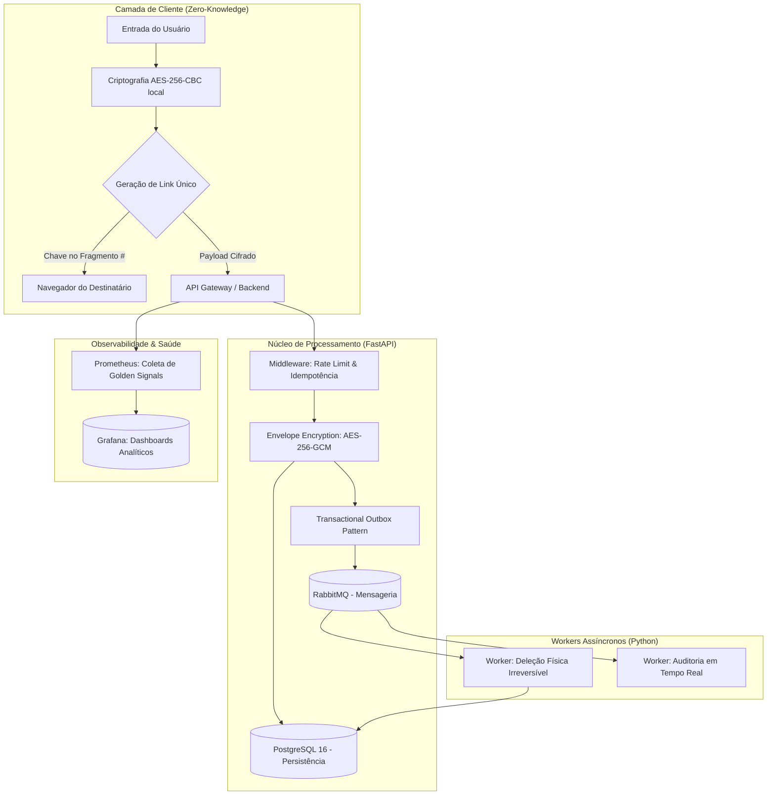

# 🛡️ Cofre Digital

[](https://github.com/LuahnKaye/Cofre_Digital/actions/workflows/ci.yml)
[](https://fastapi.tiangolo.com/)
[](https://reactjs.org/)
[](https://www.postgresql.org/)
[](https://www.rabbitmq.com/)

O **Cofre Digital** é uma solução de nível empresarial para o compartilhamento seguro de informações sensíveis que se auto-destroem. O projeto foi concebido sob os pilares de **Privacidade Absoluta**, **Resiliência Distribuída** e **Alta Observabilidade**, utilizando padrões arquiteturais modernos para garantir que segredos nunca sejam expostos, nem mesmo para os administradores da plataforma.

---

## 🏗️ Arquitetura e Decisões Técnicas

O sistema utiliza uma abordagem de **Micro-serviços Orquestrados** e **Arquitetura Limpa (Clean Architecture)** para separar as regras de negócio das preocupações de infraestrutura.



---

## 🚀 Diferenciais do Projeto (Stack Tecnológica)

### 1. Segurança de Ponta-a-Ponta
*   **Arquitetura Zero-Knowledge**: A criptografia primária ocorre no navegador. O servidor nunca recebe o segredo original; ele armazena apenas o conteúdo já cifrado. A chave de decifração viaja via *URL Fragment* (#), que não é enviado ao servidor em futuras requisições HTTP.
*   **Envelope Encryption**: Camada secundária de proteção no servidor usando AES-256-GCM com chaves exclusivas geradas por segredo, protegendo contra vazamentos de banco de dados.
*   **Argon2id**: Hashing de senhas utilizando o algoritmo vencedor da *Password Hashing Competition*, garantindo resistência máxima contra ataques de força bruta e GPU.

### 2. Resiliência e Consistência
*   **Transactional Outbox Pattern**: Implementação para garantir atomicidade entre a persistência no banco de dados e a publicação de eventos no RabbitMQ. Isso impede que um segredo seja lido sem que sua ordem de deleção física seja gerada.
*   **Idempotency Control**: Middleware baseado em Redis que utiliza chaves de idempotência para prevenir a duplicidade de ações em caso de instabilidade na rede.
*   **Rate Limiting Proativo**: Proteção baseada em IP e Endpoint via Redis para mitigar ataques de DoS e tentativas de enumeração de segredos.

### 3. Observabilidade Sênior (Golden Signals)
*   **Métricas Customizadas**: Exportação de dados via Prometheus para monitorar os 4 Sinais de Ouro: **Latência, Tráfego, Erros e Saturação**.
*   **Painéis Analíticos**: Integração nativa com Grafana para visualização da saúde operacional do sistema.

### 4. Infraestrutura como Código (IaC) e DevOps
*   **Terraform**: Provisionamento automatizado de infraestrutura Cloud (VPC, RDS, EKS).
*   **Kubernetes (K8s)**: Manifestos completos com ReplicaSets, HPA (Horizontal Pod Autoscaler) e Liveness/Readiness Probes.
*   **GitHub Actions**: Esteira de CI/CD configurada para linting, testes de unidade e automação de deploys.

---

## 🛠️ Como Executar

O projeto foi desenhado para um onboarding rápido (Developer Experience):

```bash
# Sobe toda a stack (DB, Cache, Mensageria, API, Observabilidade)
make up

# Popula o banco com um usuário administrativo e dados de teste
make seed

# Inicia o servidor de desenvolvimento do Frontend
make frontend-dev
```

### Endpoints Principais
*   **Frontend**: [http://localhost:5174](http://localhost:5174)
*   **Documentação Interativa (Swagger)**: [http://localhost:54321/docs](http://localhost:54321/docs)
*   **Prometheus (Métricas)**: [http://localhost:9090](http://localhost:9090)
*   **Grafana (Dashboards)**: [http://localhost:3000](http://localhost:3000)

---

## 📄 Documentação Técnica Adicional
As decisões arquiteturais estão registradas na pasta `docs/adrs/`:
*   [ADR-001: Zero-Knowledge Architecture](docs/adrs/001_zero_knowledge.md)
*   [ADR-002: Outbox Pattern Implementation](docs/adrs/002_outbox_pattern.md)
*   [ADR-003: Observabilidade Sistêmica](docs/adrs/003_observabilidade.md)

---
