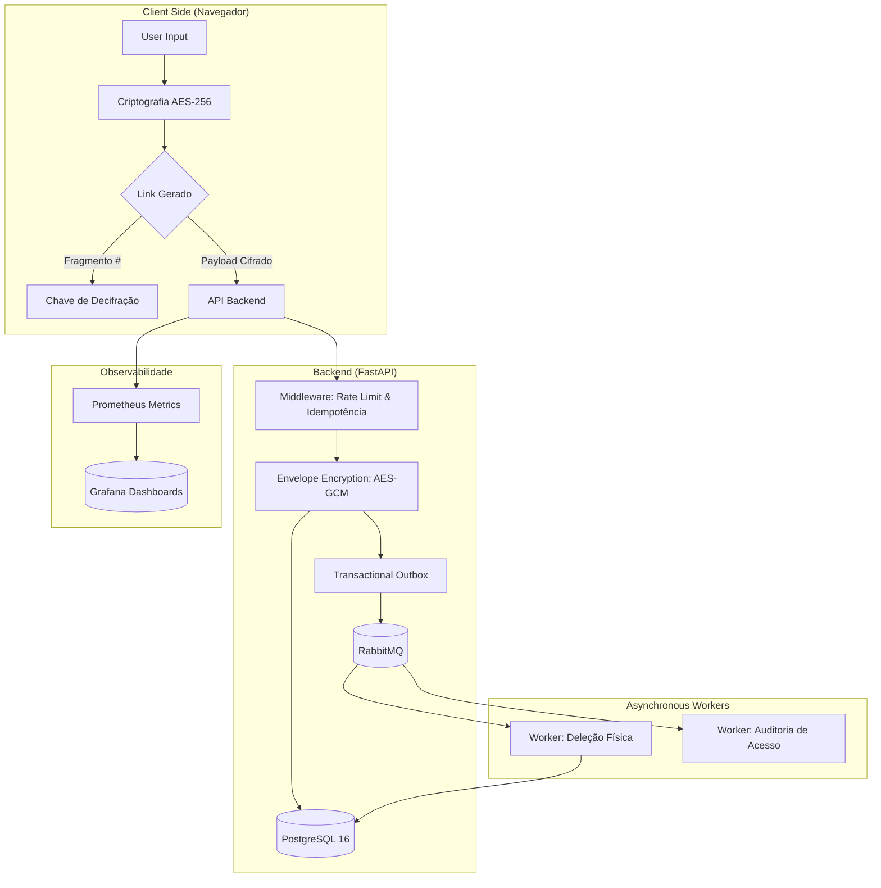

# 🛡️ Cofre Digital — Zero-Knowledge Secret Sharing

[](https://fastapi.tiangolo.com/)
[](https://reactjs.org/)
[](https://www.postgresql.org/)
[](https://www.rabbitmq.com/)
[](https://prometheus.io/)

**Cofre Digital** é uma plataforma de alta segurança para compartilhamento de segredos que se auto-destroem. Projetada com uma arquitetura **Zero-Knowledge**, onde nem mesmo o administrador do servidor tem acesso aos dados descriptografados.

---

## 🏗️ Arquitetura do Sistema



---

## 🔒 Segurança de Nível Enterprise

1.  **Zero-Knowledge Architecture**: O segredo é cifrado no cliente antes do envio. A chave viaja na URL como um fragmento (`#`), que nunca é enviado ao servidor pelo navegador.
2.  **Criptografia de Envelope**: No servidor, os dados já cifrados recebem uma segunda camada de proteção (AES-256-GCM) com chaves mestras geradas por segredo.
3.  **Destruição Atômica**: O sistema garante que, após o limite de acessos ou expiração, os dados sejam fisicamente removidos do banco e do cache via workers assíncronos.
4.  **Transactional Outbox Pattern**: Garante a consistência eventual perfeita; um evento de deleção nunca é perdido, mesmo se o broker (RabbitMQ) estiver temporariamente fora do ar.

---

## 🚀 Como Iniciar

### Pré-requisitos
*   Docker & Docker Compose
*   Python 3.12+ (opcional para rodar local)

### Quick Start (3 Comandos)

```bash
# 1. Subir toda a infraestrutura (DB, Cache, Broker, Metrics)
make up

# 2. Popular banco com dados de teste
make seed

# 3. Iniciar o Frontend
make frontend-dev
```

Acesse:
*   **App**: [http://localhost:5174](http://localhost:5174)
*   **API Docs**: [http://localhost:54321/docs](http://localhost:54321/docs)
*   **Monitoramento**: [http://localhost:3000](http://localhost:3000) (admin/admin)

---

## 📊 Observabilidade (Golden Signals)

O sistema expõe métricas nativas para o Prometheus focadas nos 4 Golden Signals:
*   **Latência**: Tempo de resposta por endpoint.
*   **Tráfego**: Volume de requisições.
*   **Erros**: Taxa de falhas 4xx/5xx.
*   **Saturação**: Uso de recursos do sistema.

---

## 🛠️ Tecnologias Utilizadas

*   **Backend**: Python, FastAPI, SQLAlchemy, Alembic.
*   **Frontend**: React, Vite, Framer Motion, Lucide.
*   **Infra**: PostgreSQL, Redis, RabbitMQ.
*   **Observability**: Prometheus, Grafana.

---

Desenvolvido com ❤️ para portfólios de alta performance.
